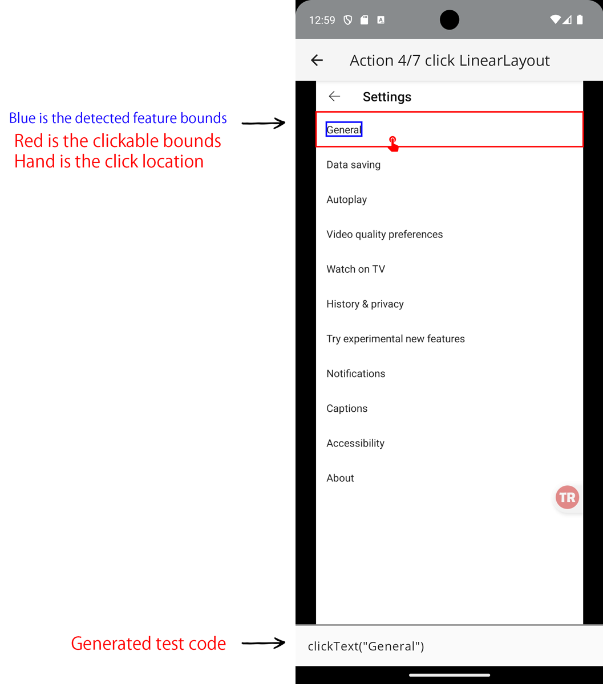
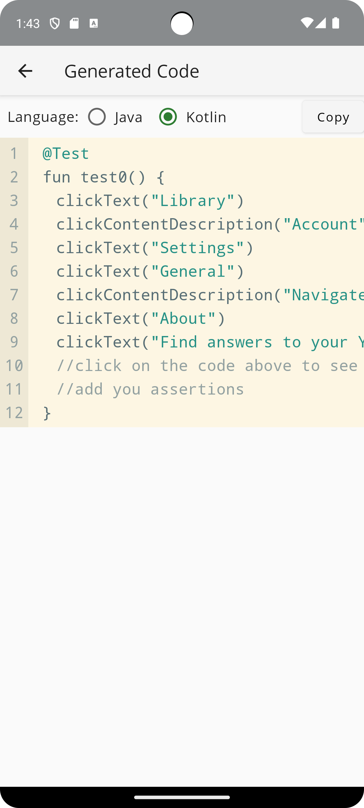

# Android Test Recorder

[](https://github.com/xuduo/Android-Test-Recorder/actions/workflows/android-ci.yaml)
[](https://sonarcloud.io/summary/new_code?id=xuduo_Android-Test-Recorder)
[](https://sonarcloud.io/summary/new_code?id=xuduo_Android-Test-Recorder)
[](https://sonarcloud.io/summary/new_code?id=xuduo_Android-Test-Recorder)
[](https://sonarcloud.io/summary/new_code?id=xuduo_Android-Test-Recorder)
[](https://sonarcloud.io/summary/new_code?id=xuduo_Android-Test-Recorder)

## Introduction
The Android Test Recorder is a powerful tool for automating UI tests, similar to [Google's Espresso Test Recorder](https://developer.android.com/studio/test/other-testing-tools/espresso-test-recorder). It simplifies the process of creating test scripts for Android applications.

## Compatibility and Features
- Runs in the Android OS, don't need adb connection
- Compatible with Android 8 to 14.
- Supports apps built with Flutter and Compose, which doesn't have a Android view hierarchy.
- No rooting required.

## Usage Example
1. **Capture User Interactions**: Utilizes AccessibilityService, MediaProjection, and OverlayView to capture user clicks.
   
2. **Automatic Script Generation**: Automatically generates test scripts based on captured user interactions.
   
3. **Helper Code for Test Classes**: Incorporates helper code in your base test class, with an example provided for Kotlin & UIAutomator.

### Helper Code Example

```kotlin
import androidx.test.uiautomator.By
import androidx.test.uiautomator.UiDevice
import androidx.test.uiautomator.Until
import androidx.test.platform.app.InstrumentationRegistry

open class BaseTest {

    private val uiDevice: UiDevice = UiDevice.getInstance(InstrumentationRegistry.getInstrumentation())

    fun clickText(text: String) {
        val selector = By.text(text)
        val obj = uiDevice.findObject(selector)
        obj?.let {
            if (!it.wait(Until.clickable(true), 5000)) {
                throw AssertionError("View with text '$text' not found or not clickable")
            }
            it.click()
        } ?: throw AssertionError("View with text '$text' not found")
    }

    fun clickContentDescription(description: String) {
        val selector = By.desc(description)
        val obj = uiDevice.findObject(selector)
        obj?.let {
            if (!it.wait(Until.clickable(true), 5000)) {
                throw AssertionError("View with content description '$description' not found or not clickable")
            }
            it.click()
        } ?: throw AssertionError("View with content description '$description' not found")
    }
}
```
## Project Structure
1. apps: Contains the main application of the recorder.
2. model: Includes ViewModels and model-level code for the main application.
3. common: Features quality of life code that enhances the overall functionality.
4. dummy-app-for-testing: A simple application built using Jetpack Compose, serving as a test subject for the main app.
